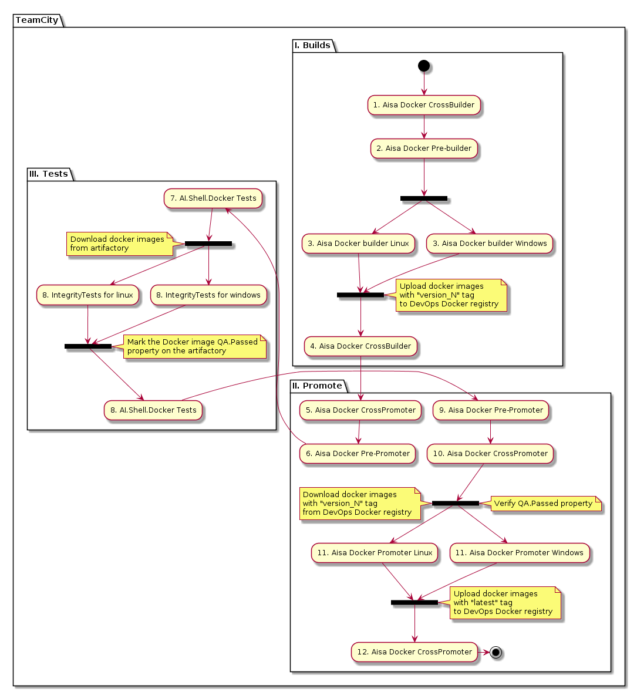
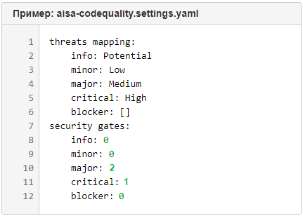

# DevSecOps: внедрение в продуктовый конвейер и эксплуатация анализатора кода PT Application Inspector

Внимание! **Это неофициальная документация для DevOps-инженеров**. Здесь вы найдёте рекомендуемую архитектуру серверной и клиентской частей, а также скрипты для автоматизации работы с PT Application Inspector и шаблоны для интеграции с различными CI-системами.

**Пожалуйста, при любом использовании материалов из данного документа, оставляйте ссылку на проект:** https://github.com/devopshq/dohq-ai-best-practices Материалы периодически обновляются, и это позволит избежать использования неактуальной версии.

**Официальную документацию** для PT Application Inspector вместе с пилотом вы можете запросить напрямую на страничке продукта: [https://www.ptsecurity.com/ru-ru/products/ai/](https://www.ptsecurity.com/ru-ru/products/ai/)

Узнать про внедрение PT Application Inspector можно из [первого вебинара](https://www.ptsecurity.com/ru-ru/research/webinar/devsecops-vnedrenie-v-produktovyj-konvejer-i-ehkspluataciya-pt-application-inspector/) или из [статьи на Хабре](https://habr.com/ru/company/pt/blog/534458/), а про работу AI в сборочном конвейере и как найденные уязвимости блокируют выпуск релиза — из [второго вебинара](https://www.ptsecurity.com/ru-ru/research/webinar/devsecops-pt-application-inspector-v-razrabotke-po-blokirovka-reliza/).

_Инструкция ниже, методика и рекомендации актуальны для AI сервера []v.3.6.1](./.media/ptaiee_adminguide_ru.pdf)_

# Содержание

1. [Для чего нужен PT Application Inspector](#для-чего-нужен-pt-application-inspector)
2. [Методика внедрения PT AI в CI](#методика-внедрения-pt-ai-в-ci)
3. [Архитектура предлагаемого решения](#архитектура-предлагаемого-решения)
4. [Сборочная CI-инфраструктура](#сборочная-ci-инфраструктура)
5. [Автоматизация установки AI сервера через PowerShell](#автоматизация-установки-ai-сервера-через-powershell)
6. [Цикл релизной сборки Application Inspector Shell Agent в Docker](#цикл-релизной-сборки-application-inspector-shell-agent-в-docker)
7. [Алгоритм работы с использованием AISA](#алгоритм-работы-с-использованием-aisa)
8. [Типовые шаблоны для отправки проектов на сканирование в AI](#типовые-шаблоны-для-отправки-проектов-на-сканирование-в-ai)
9. [AI Security Gates](#ai-security-gates)
10. [Утилиты и переменные окружения](#утилиты-и-переменные-окружения)
11. [Инструкция по использованию метараннеров в TeamCity](#инструкция-по-использованию-метараннеров-в-teamcity)
12. [Пример отчетов](#пример-отчетов)
13. [Содержимое репозитория](#содержимое-репозитория)
                                                                                                
## Для чего нужен PT Application Inspector

PT Application Inspector — удобный инструмент для выявления уязвимостей и ошибок в приложениях, поддерживающий процесс безопасной разработки.

PT Application Inspector выделяется среди конкурентов исключительной точностью результатов благодаря сочетанию ключевых методов анализа с уникальной технологией абстрактной интерпретации. PT AI позволяет специалистам по ИБ выявлять и подтверждать уязвимости и признаки НДВ, например закладок, оставленных в исходном коде разработчиками или хакерами, а разработчикам — ускорить исправление кода на ранних стадиях разработки.

**Список поддерживаемых языков:** `java`, `php`, `c#`, `vb`, `objective-c`, `c++`, `sql`, `swift`, `python`, `javascript`, `go`, `kotlin`

Подробнее о продукте: [https://www.ptsecurity.com/ru-ru/products/ai/](https://www.ptsecurity.com/ru-ru/products/ai/)

## Методика внедрения PT AI в CI

**Основные этапы методики:**

1. Подготовка серверной части
   - Установка и настройка сервера
   - Установка и настройка агентов сканирования
2. Подготовка клиентской части
   - Организация релизного CI-цикла для клиента AISA (поставка docker-образом)
3. Подготовка проекта сканирования
   - На стороне сервера
   - Через клиент AISA
4. Работа с CI-системами
   - Шаблоны сканирования в GitLab CI
   - Метараннеры TeamCity
   - Прочие средства (работа с CLI AISA)

Для упрощения работы с PT Application Inspector мы подготовили CI-инженерам небольшой список рекомендаций по внедрению и технической эксплуатации серверной, клиентской и CI частей PT AI. Мы оформили эти рекомендации в виде простой методики, шаги которой вы видите выше.

Первая важная рекомендация методики заключается в том, чтобы архитектурно разместить серверную часть PT Application Inspector на отдельной ВМ. Это упростит её настройку, обновление и мониторинг, чем если бы сканирующий сервер устанавливался на каждом сборочном агенте, либо подтягивался туда докер-образом. В отличие от клиента AISA, обёрнутого в докер (об этом дальше), с сервером мы так делать не рекомендуем. По крайней мере до тех пор, пока PT Application Inspector Server не будет официально поставляться как докер-образ.

Вторая рекомендация, заключается в том, чтобы обязательно "обернуть" поставляемые бинари клиента AISA в докер-образы, версионировать их и настроить релизный цикл в вашей CI-системе. Это значительно упростит вашим CI-инженерам распространение AISA-клиента по сборочной инфраструктуре: не придётся каждый раз устанавливать клиентскую часть на все сборочные агенты, а также это позволит быстро откатиться на предыдущие версии AISA простой заменой тега latest для докер-образа, в случае каких-либо ошибок.

Зачем всё это делать? Чтобы чётко отделить инфраструктурную часть AI от процесса разработки и сборки продуктов. CI-инженеры, работающие с PT AI должны отвечать за сборочную инфраструктуру, инфраструктуру сканирования через AI и интеграцию с ней сборок, а разработчики продуктов должны иметь простую возможность подключить свой код на анализ, работать с получаемыми от AI результатами и повышать безопасность и качество своего кода.

Подробнее об архитектуре и реализации шагов предлагаемой нами методики вы можете прочитать дальше и посмотреть [вебинар](https://www.ptsecurity.com/ru-ru/research/webinar/devsecops-vnedrenie-v-produktovyj-konvejer-i-ehkspluataciya-pt-application-inspector/) по теме внедрения.

## Архитектура предлагаемого решения


**Легенда**

- DevOps.BuildAgent — сборочный агент
- Docker.Linux.AISA.Latest/TAG — все докер-образы клиента AISA, доступные по тегу
- AI.Agent — агент сканирования
- PT AI AI.Server — PT Application Inspector сервер
- DevOps.GitLab — хранилище кода
- DevOps.GitLab-CI — CI-система
- DevOps.Artifactory — хранилище артефактов
- Docker.Registry — хранилище докер-образов
- Docker.Linux.AISA — артефакт сборки клиента AISA (рабочий докер-образ с клиентом)
- AI.Shell Agent — клиент AISA, запущенный внутри докер-контейнера, работающий с API AI-сервера
- BuildAgent.Console — системная консоль сборочного агента
- workingDirectory — рабочий каталог на сборочном сервере с исходным кодом, который будет сканироваться

Мы рекомендуем развернуть серверную часть AI (на схеме обозначено как AI.Server) и сканирующие агенты (AI.Agent) на отдельных ВМ.

Исходный код (source code) из проекта на GitLab (DevOps.GitLab) выгружается на сборочный агент (DevOps.BuildAgent) в рабочую директорию сборки, а затем передаётся для анализа на сервер AI через консольный клиент AISA (AI.LightweightClient). Клиент умеет работать с API сервера AI. AISA — это аббревиатура от Application Inspector Shell Agent.

Возможности передать код на AI-сервер напрямую из GitLab-проекта, без физического копирования со сборочного агента, сейчас нет, но в будущих версиях AISA такая возможность появится.

Клиент AISA запускается в отдельном докер-контейнере (Docker.Windows/Linux.AISA-client), который является своеобразной "обёрткой" над ним. Образы собираются служебными сборочными конфигурациями (DevOps.GitLab-CI), которые поддерживают CI-инженеры нашего DevOps-отдела. После сборки образы выкладываются в docker registry на Артифактории (DevOps.Artifactory). Рекомендуется настроить релизный цикл и приёмочное тестирование для подготовки таких образов, как показано далее. Благодаря поставке докер-образами сборочная инфраструктура не будет зависеть от разработки клиента AISA.

**Плюсы архитектуры:**

- Минимальные трудозатраты инженеров группы инфраструктуры на развёртывание, эксплуатацию и обновление сервера AI, в отличие от двух других вариантов архитектур.
- Требуется настройка мониторинга только сервера AI и сканирующих агентов, то есть небольшого количества ВМ.
- Наличие API: команды для передачи кода на сканирование унифицированы через легковесный клиент AISA и не придётся перенастраивать сотни сборочных конфигураций в случае изменения контрактов в новых версиях AI-сервера.
- По аналогичному принципу (передача кода на анализ во внешние сервисы) работают все облачные сканеры кода, например, Codacy и SonarQube. Хотя GitLab использует интегрированное серверное решение для своего Code Quality сервиса.
- В предлагаемой архитектуре можно отделить анализ кодовой базы от сборочного процесса.

**Минусы архитектуры:**

- Более сложное внедрение анализатора кода в сборочный процесс, за счёт дополнительных шагов и настроек сборки. Требуется разработка скриптов интеграции с CI-системами и шаблонов для запуска сканирования. Это сложнее, чем в случае, когда AI-сервер и агент сканирования расположены на билд-агенте.
- Потенциально может возникнуть больше проблем со сборками, за счёт добавления нового внешнего сервиса в сборочный конвейер.
- Возможно значительное ожидание сборок в очереди, пока сканирование идёт на одном AI-сервере.
- Пока неизвестны требования по железу для масштабирования и обеспечения сканирований для десятков и сотен тысяч сборок в день.

Как мы решили некоторые проблемы с выбранной архитектурой, смотрите [демо на вебинаре](https://www.ptsecurity.com/ru-ru/research/webinar/devsecops-vnedrenie-v-produktovyj-konvejer-i-ehkspluataciya-pt-application-inspector/).

## Сборочная CI-инфраструктура


Особое внимание мы уделяем разработке типовых проектов для систем непрерывной интеграции. Мы выделяем так называемую релизную схему сборок с продвижениями, основную часть которой вы видите на схеме. Если очень упростить и обобщить эту релизную схему, то она включает в себя следующие этапы:

- кроссплатформенная сборка продукта,
- деплой на тестовые стенды,
- выполнение функциональных и иных тестов,
- продвижение протестированных сборок в релизные репозитории на Artifactory,
- публикация релизных сборок на серверах обновлений,
- доставка сборок и обновлений на инфраструктуру заказчиков,
- запуск инсталляции или обновления продукта.

Скорее всего, в вашей компании присутствуют примерно такие же этапы разработки. Встаёт задача: **как внедрить в уже имеющиеся и сложившиеся сборочные процессы новый этап сканирования кода при помощи Application Inspector**? Мы рассматривали несколько вариантов:

- (перед Promoting) выполнять сканирование кода только протестированных компонент перед их продвижением в релизный репозиторий,
- (перед Publishing) выполнять сканирование кода только релизных инсталляторов и их компонент перед их публикацией на серверах обновлений,
- (внутри Testing) сделать сканирование кода как один из видов приёмочных тестов,
- (перед Building) запускать сканирование кода до выполнения шага компиляции компоненты на этапе сборки,
- (после Building) запускать сканирование кода после компиляции компоненты, перед выкладкой артефакта в хранилище.

Каждый из этих вариантов имеет плюсы и минусы: например, сканируя код только перед продвижением в релиз можно минимизировать нагрузку на сканирующий сервер AI. Однако мы рекомендуем вам вариант: **"запускать сканирование кода до выполнения шага компиляции компоненты на этапе сборки"**.

Этот вариант позволяет достаточно легко внедрить шаг сканирования прямо в шаблоны сборочных конфигураций и тиражировать это решение по множеству компонент и инсталляторов продуктов. Для этого мы написали несколько скриптов для запуска сканирования, типовые задачи (job) для GitLab CI, с примерами параметризации и запуска этих скриптов, и сохранили их в этом репозитории.

Таким образом, вы сможете избавить разработку от необходимости обращаться к CI-инженерам: при необходимости они смогут сами подключить шаги сканирования в сборках новых компонент.


Если обобщить всё сказанное выше, мы рекомендуем вам запускать сканирование кода через PT AI до выполнения шага компиляции компонент на этапе сборки. Сам сервер PT AI в вашей CI-инфраструктуре лучше разместить на отдельном виртуальном сервере, а запуском сканирования и передачей кода на анализ будет заниматься консольный клиент AISA, "обёрнутый" в докер. Шаги сканирования лучше выполнять в параллельном пайплайне.

Типовой сборочный CI-процесс с шагами сканирования через PT AI, может выглядеть как на схеме выше:

1. Build agent requesting source code — Сборочный агент в момент старта сборки запрашивает исходный код проекта на GitLab.
2. Pulling project source code into build agent working directory — Исходный код проекта скачивается на сборочный агент.
3. Running build-on-server script and starting all build jobs step-by-step — Запускается скрипт build-on-server и начинают выполняться по порядку шаги сборки. Этот скрипт — точка входа для разделения логики сборки и её внедрения в CI-конвейер. Разработчики пишут build-on-server скрипт, так как знают логику компиляции своего продукта, а CI-инженеры вызывают его в шагах сборки в своей CI-системе.
4. Running lightweight AISA-client with project configuration in parallel mode — В параллельном с основной сборкой режиме запускается легковесный клиент AISA. Он использует конфигурационный файл с настройками сканирования.
5. Transporting source code to scan to the AI Server — Передача кода на сканирование на сервер AI.
6. Running scan engine to analyze code — Сервер AI распределяет код между агентами сканирования, на которых запускается процесс анализа кода.
7. Scanning... (Without affecting main build) — Выполняется сканирование кода проекта. Сканирование никак не мешает основному сборочному процессу, так как выполняется на отдельных серверах.
8. Saving "Scan Report" on AI Server Database — Результаты сканирования сохраняются в базе данных на AI сервере.
9. Receiving "Scan Report" via AISA — AISA-клиент получает результаты сканирования со стороны сервера AI и они становятся доступны в сборочном пайплайне.
10. Checking "Security Gates" and return "Code Quality Status" — Выполняется проверка правил "Security Gates". Результатом проверки является значение "Code Quality Status" — это 0, в случае если все условия правил выполняются, и 1, если одно или больше условий не выполняются.
11. If "Code Quality Status" is 0 then scan and build are successful finished. Otherwise build stopped and log record with security issues. — Если "Code Quality Status" равен 0, тогда считается, что пайплайн сборки и сканирования завершились успешно. В другом случае, сборка может быть остановлена и добавлены соответствующие записи в логи о проблемах с безопасностью кода.
12. Publishing build artifacts on Artifactory, it possible with some quality tags — Артефакт сборки публикуется в хранилище на Artifactory. Дополнительно к артефакту могут быть добавлены некоторые метки качества.
13. Special bot publishing "Scan report" and "Security Gates" check result as "Code Quality Status" into GitLab CI pipeline and merge request on GitLab. Sending notification about build and scanning result to the development team. — Специальный бот публикует отчёт по сканированию и результаты проверки правил "Security Gates" в пайплайне на GitLab CI и в мердж-реквесте GitLab. Команде разработки отправляется нотификация об успешной сборке и прикладываются результаты сканирования.

## Автоматизация установки AI сервера через PowerShell

Для облегчения установки AI сервера можно использовать скрипт-установщик, исходный код которого доступен в директории [AIE_Server_installation](/AIE_Server_installation)

## Цикл релизной сборки Application Inspector Shell Agent в Docker

Далее на схемах описан один из возможных способов, как организовать CI для клиента AISA в вашей инфраструктуре.




### Сборка Docker контейнеров

Примеры Dockerfile-ов можно посмотреть в директории [AISA_Docker](/AISA_Docker).

На вход подается три основных параметра: токен доступа, адрес сервера и установочный пакет.

| Args           | Описание                                                                                             |
|----------------|------------------------------------------------------------------------------------------------------|
| `AISA_TOKEN`   | Токен доступа к AI серверу со стороны AISA.                                                         |
| `AISA_URI`     | URI до сервера.                                                                                      |
| `AISA_PACKAGE` | Путь до пакета.<br>Можно выкачивать как через wget, так и класть в репозиторий с файлами для докера. |

Как временное решение используются вспомогательные утилиты на Python. Более подробно об них смотрите в разделе "[Утилиты и переменные окружения](#утилиты-и-переменные-окружения)".

Первый этап включает в себя одновременную сборку двух докер-образов под Linux и Windows и выкладывание их в докер-регистри. Для докер-тега используется версия AISA и билд-номер. По завершению этапа сборки, на докер-образы, как на артефакты, назначаются дополнительные метки, например, пустые "метки качества".

Вторым этапом является назначение на докер-образы тега `latest`, что является условием к их продвижению (promote) из snapshot-репозитория в release-репозиторий. Неотъемлемой частью этого процесса является третий этап приемочного тестирования, по завершению которого на докер-образы назначаются метки качества, которые будут проверены в следующих шагах "промоутера".

В случае, если в ходе эксплуатации новой версии клиента AISA будет найден баг непокрытый тестами, можно вручную запустить этап продвижения и передать на вход предыдущую версию докер-образа. Повторное тестирование при этом не производится, так как метки качества были проставлены ранее.

Для сборки Docker образов `aisa-windows` и `aisa-linux` можно использовать схему версии `major.minor.patch.build-docker_build`, где `major.minor.patch.build` является версией Application Inspector Shell Agent (AISA), а `docker_build` является версией билда сборочной конфигурации `docker builder`-a.

Теперь рассмотрим этапы сборки.

#### I. Build

На вход конфигурации `Aisa Docker CrossBuilder` передаем `AISA_TOKEN`, `AISA_URI`, `AISA_PACKAGE` и `release_build`:`TRUE`/`FALSE`

|  Этап |    Сборочная конфигурация     | Описание                                                                                                                                                                                                                                                             |
|:-----:|:------------------------------|----------------------------------------------------------------------------------------------------------------------------------------------------------------------------------------------------------------------------------------------------------------------|
| 1 / 4 | `Aisa Docker CrossBuilder`    | Передает версию AISA на зависимые сборки.<br> Передает флаг `release_build`:`TRUE`/`FALSE` на зависимые сборки (флаг `TRUE` распространяется по умолчанию).<br> ---<br> По завершению сборок запускает `Aisa Docker Cross Promoter`, передает версию docker образов. |
|   2   | `Aisa Docker Pre-builder`     | Запускает `Aisa Docker builder Windows`.<br> Запускает `Aisa Docker builder Linux`.                                                                                                                                                                                  |
|   3   | `Aisa Docker builder Windows` | Собирает `aisa-windows`.<br> Проставляет **property** `promoted` == `None`.<br> Проставляет **property** `qa.tests` = `None`.<br> Проставляет **property** `release_build` = `TRUE`/`FALSE`.                                                                         |
|   3   | `Aisa Docker builder Linux`   | Собирает `aisa-linux`.<br> Проставляет **property** `promoted` == `None`.<br> Проставляет **property** `qa.tests` = `None`.<br> Проставляет **property** `release_build` = `TRUE`/`FALSE`.                                                                           |

#### II. Promote

Запуск механизма присвоения тега `latest` для docker образов `aisa-windows` и `aisa-linux` осуществляется путем передачи версии docker образа в формате `major.minor.patch.build-docker_build` со стороны сборочной конфигурации `Aisa Docker CrossBuilder` в сборочную конфигурацию `Aisa Docker Cross Promoter`.

|  Этап  |    Сборочная конфигурация      | Описание                                                                                                                                                                                                                                                                                                             |
|:------:|:-------------------------------|----------------------------------------------------------------------------------------------------------------------------------------------------------------------------------------------------------------------------------------------------------------------------------------------------------------------|
| 5 / 10 | `Aisa Docker Cross Promoter`   | Передает версию AISA docker-образов на зависимые сборки.<br> Передает флаг release_build:TRUE/FALSE на зависимые сборки.<br> ---<br> По завершению сборок проставляет версию AISA в property docker-образов `aisa-windows` и `aisa-linux`.<br> По завершению сборок запускает `Aisa Docker Cross Promoter`           |
|    6   | `Aisa Docker Pre-Promoter`     | Запускает `AI.Shell.Docker Tests`, передает версию docker образов<br> ---<br> По завершению тестов запускает `Aisa Docker Promoter Linux`<br> По завершению тестов запускает `Aisa Docker Promoter Windows`                                                                                                          |
|    9   | `Aisa Docker Promoter Linux`   | Получает **property** `aisa-linux` docker образа:<br> если `qa.tests` == `ok`<br> и `release_build` == `TRUE`, тегируется `latest` docker образ<br> и `release_build` = `FALSE`, тегируется `develop` docker образ<br> проставляется **property** `promoted` == `TRUE`                                               |
|    9   | `Aisa Docker Promoter Windows` | Получает **property** `aisa-windows` docker образа:<br> если `qa.tests` == `ok`<br> и `release_build` == `TRUE`, тегируется `latest` docker образ<br> и `release_build` = `FALSE`, тегируется `develop` docker образ<br> проставляется **property** `promoted` == `TRUE`                                             |

#### III. Tests

Запуск тестирования docker-образов `aisa-windows` и `aisa-linux` осуществляется путем передачи версии docker-образа в формате `major.minor.patch.build-docker_build` со стороны сборочной конфигурации `Aisa Docker Pre-Promoter` в корневую сборочную конфигурацию `AI.Shell.Docker Tests`.

|  Этап | Сборочная конфигурация  | Описание                                                                                                                                                                                                                                                                                                                                                                                            |
|:-----:|:------------------------|-----------------------------------------------------------------------------------------------------------------------------------------------------------------------------------------------------------------------------------------------------------------------------------------------------------------------------------------------------------------------------------------------------|
| 7 / 9 | `AI.Shell.Docker Tests` | Передает версию AISA docker-образов на зависимые сборки.<br> Запускает проверку на наличие **property** `qa.tests` == `ok`. <br> *В случае, если тесты уже были пройдены - шаг тестирования пропускается*<br> Запускает группы тестов: `Tests Linux` и `Tests Windows`<br> ---<br> По завершению тестов проставляет **property** `qa.tests` == `ok` на `aisa-windows` и `aisa-linux` docker образы. |
|   8   | `Tests Linux`           |                                                                                                                                                                                                                                                                                                                                                                                                     |
|  ...  | Тестовые конфигурации   |                                                                                                                                                                                                                                                                                                                                                                                                     |
|   8   | `Tests Windows`         |                                                                                                                                                                                                                                                                                                                                                                                                     |
|  ...  | Тестовые конфигурации   |                                                                                                                                                                                                                                                                                                                                                                                                     |

Примеры приёмочных тестов:

|   №  |                       Сборочная конфигурация                        | Описание                                                             |
|:----:|:--------------------------------------------------------------------|----------------------------------------------------------------------|
| 1.   | `AI.Shell.Docker Tests`                                             | Root конфигурация, которая запускает все интеграционные тесты        |
| 2.   | **Tests Linux**                                                     |                                                                      |
| 2.1. | `[IntegrityTest] Docker aisa-linux create project`                  | Создание проекта без запуска сканирования                            |
| 2.2. | `[IntegrityTest] Docker aisa-linux create project with policy`      | Назначение политики сканирования на проект, без запуска сканирования |
| 2.3. | `[IntegrityTest] Docker aisa-linux create project and quick scan`   | Создание проектов и запуск сканирования без ожидания завершения      |
| 2.4. | `[IntegrityTest] Docker aisa-linux create project and long scan`    | Создание проектов и запуск сканирования с ожиданием завершения       |
| 2.5. | `[IntegrityTest] Docker aisa-linux quick scan`                      | Запуск сканирования без ожидания завершения                          |
| 2.6. | `[IntegrityTest] Docker aisa-linux long scan`                       | Запуск сканирования с ожиданием завершения                           |
| 2.7  | `[IntegrityTest] Docker aisa-linux get multi-report`                | Запуск сканирования с последующим получением всех типов отчетов      |
| 3.   | **Tests Windows**                                                   |                                                                      |
| 3.1. | `[IntegrityTest] Docker aisa-windows create project`                | Создание проекта без запуска сканирования                            |
| 3.2. | `[IntegrityTest] Docker aisa-windows create project with policy`    | Назначение политики сканирования на проект, без запуска сканирования |
| 3.3. | `[IntegrityTest] Docker aisa-windows create project and quick scan` | Создание проектов и запуск сканирования без ожидания завершения      |
| 3.4. | `[IntegrityTest] Docker aisa-windows create project and long scan`  | Создание проектов и запуск сканирования с ожиданием завершения       |
| 3.5. | `[IntegrityTest] Docker aisa-windows quick scan`                    | Запуск сканирования без ожидания завершения                          |
| 3.6. | `[IntegrityTest] Docker aisa-windows long scan`                     | Запуск сканирования с ожиданием завершения                           |
| 3.7. | `[IntegrityTest] Docker aisa-windows get multi-report`              | Запуск сканирования с последующим получением всех типов отчетов      |


## Алгоритм работы с использованием AISA


 
После старта задачи происходит выгрузка исходного кода и загрузка докер-образа на CI-агент. Затем, в зависимости от операционной системы, используется либо Linux либо Windows докер-образ с AISA. Для генерации проекта используется вспомогательная утилита - [aisa-set-settings](/AISA_Docker/aisa-linux/docker_build_data/applications/aisa-set-settings.py), генерирующая `.aiproj` файл с настройками проекта.

В случае, если проект был создан заранее, то можно использовать аргумент `--project-name`, для отправки исходного кода сразу в нужный проект. Если же проекта ещё нет на сервере AI, то можно использовать аргумент `--project-settings-file`, которому передается имя файла с настройками проекта. При отправке исходного кода на сервер проект будет создан и код начнет сканироваться. А при повторном использовании настройки обновятся.

Время ожидания окончания сборки можно сократить при использовании аргумента `--no-wait`, тогда Aisa только отправит исходный код на сервер, без ожидания результатов. Если отчеты нужны, то следует воспользоваться аргументами `--reports` и `--reports-folder`.
 
## Типовые шаблоны для отправки проектов на сканирование в AI

### Как подключить AI скан в сборочном проекте GitLab CI

- Выберите шаблон в директории [GitLab_templates](/GitLab_templates).
- Откройте `.gitlab-ci.yml` в корне вашего сборочного проекта.
- Добавьте `include` выбранного вами шаблона.
- При необходимости добавьте необходимые `Variables` в `.gitlab-ci.yml` вашего сборочного проекта.
- В случае, если ваш проект сканируется слишком долго, вы можете сканировать его в режиме без ожидания с помощью аргумента `--no-wait`.

Пример добавления шаблона можно посмотреть тут: [example.yml_1](/GitLab_templates/example_1.yml)и [example_2.yml](/GitLab_templates/example_2.yml)

### Какие типовые шаблоны существуют

###### Шаблон для **существующего** проекта на AI сервере

- Имя проекта задается автоматически как `$CI_PROJECT_NAME` (имя проекта в GitLab).
- Отчеты создаются автоматически в `HTML` или `JSON` форматах и складываются в директорию `.report` на сборочном агенте. По умолчанию, они доступны на протяжении трех дней.

###### Шаблон для **не существующего** проекта на AI сервере

- Имя проекта задается вручную (один раз на шаблон).
- Язык программирования задается дополнительной переменной.
- Отчеты получаются в виде артефакта в `HTML` или `JSON` форматах и складываются в директорию `.report` на сборочном агенте. По умолчанию, они доступны на протяжении трех дней.

###### Продуктовые шаблоны

- Создаются под нужды конкретной команды (могут быть типовыми для большого количества проектов).
- Обладают широкой возможностью кастомизации.
- Команда может вносить правки самостоятельно и создавать свои шаблоны (через **MR**).

### Как получить отчет

Существует несколько вариантов получения отчета:
1. Обратившись к AI серверу напрямую.
2. Получить в виде артефакта после завершения сканирования.

Отчет сохраняется на GitLab-раннере в виде артефакта и может быть нескольких форматов: `HTML`, `PDF`, `JSON` и `WAF`. Отчет может быть интегрирован с различными CI-системами и сервисами. Например, он может быть:
- сохранен на Artifactory,
- интегрирован с GitLab Code Quality в MR,
- опубликован в логах сборки GitLab CI,
- опубликован на GitLab Pages,
- отправлен на e-mail.

## AI Security Gates

**AI Security Gates** — это набор правил для проекта сканирования, которые указывают CI-системе как группировать найденные уязвимости и как на них реагировать: блокировать сборку или мердж-реквест, либо работать в режиме информирования.

Сами правила описываются в обычном yaml-файле, состоящем из двух разделов:
- **threats mapping** — отвечает за маппинг и соответствие терминологии критичности проблем кода от самого GitLab (имена ключей) и терминологии критичности уязвимостей от PT AI (значения ключей). Кроме того, для удобства работы можно сгруппировать в этом разделе уязвимости по типу. Например, сказать, чтобы GitLab сгруппировал Potential, Low, Medium уязвимости от AI и отображал их в Info группе проблем.
- **security gates** — в этой секции указывается количество уязвимостей для конкретной группы критичности. Если AI найдёт в коде уязвимостей больше либо равное этому числу, то мердж-реквест или сборка будут заблокированы. Ноль — означает не выполнять проверку количества (если все нули, то сканирование фактически ведётся в режиме информирования).




Мы разработали три типа шаблонов сканирования, каждый для своего типа веток. В фича-ветках мы храним шаблоны, которые сканируют **в режиме информирования**. При влитии в релизные ветки или master мы используем на выбор **шаблон с блокировкой** или **самый строгий шаблон**.

В чём их отличия, представлено в табличке. Основное различие шаблонов — в их влиянии на сборку и в глубине интеграции сканирования со сборочным пайплайном. Например, самый строгий режим сканирования при непрохождении правил Security Gates одновременно блокирует и мердж-реквест и сам сборочный пайплайн.


### AI Security Gates: Information mode


Для примера, пусть сама сборка состоит из типовых шагов:
- юнит-тестирование кода (Unit tests),
- сборка или компиляция (Build),
- публикация собранного артефакта сборки в некотором хранилище (Upload to registry).

В GitLab CI все шаги сборки описываются в специальном конфигурационном файле gitlab-ci.yml. В этот файл можно импортировать любые другие шаблоны через команду include. При подключении шаблона сканирования он добавляет к схеме пайплайна дополнительные шаги:
- запуск в параллельном режиме внешнего пайплайна сканирования (Start AI Scan);
- отправка кода на сервер AI и запуск сканирования через клиент AISA (AI-Scanning);
  - в случае любых проблем с инфраструктурой сканирования информация об этом отправляется на мониторинг (Send info);
- по окончании сканирования AISA получает отчёт с сервера AI о найденных уязвимостях и добавляет к пайплайну основной сборки (AI Scan Report);
- проверка правил Security Gates;
  - результат проверки — Code Quality Status — также добавляется к основному пайплайну;
- отправка оповещения о результатах сканирования и сборки на почту или в чат (Send emails).

Важно отметить, что в информационном режиме сканирования результаты проверок **не блокируют сборочный пайплайн и мердж-реквест**.

### AI Security Gates: Lock mode


Следующая схема (AI Lock Mode) — чуть более строгая. Она подключается к основной сборке аналогично через include шаблона сканирования и добавляет все те же самые шаги, что и в режиме информирования.

Основные отличия этой схемы от предыдущей в том, что в основную сборку пробрасывается статус с ожиданием отчёта по сканированию (running), а также, в случае непрохождения правил Security Gates, **мердж-реквест может быть заблокирован**. **Основной сборочный процесс при этом не блокируется** и сборка может создавать и публиковать артефакты.

### AI Security Gates: Strictest mode


И, наконец, третья схема (AI Strictest Mode) — максимально строгая. Кроме шагов, как в предыдущих схемах, в дочерний пайплайн добавляется новый шаг, разрешающий либо запрещающий публикацию сборочного артефакта (Approve build). Таким образом, если будут обнаружены уязвимости, не проходящие проверки Security Gates, то **будут заблокированы основной сборочный пайплайн и мердж-реквест**. Дополнительно **мердж-реквест может быть переведён в статус черновика** (Draft).

## Утилиты и переменные окружения

Внутри CI-конвейера docker-образ с AISA должен поставляться вместе с утилитами:
- `aisa` — утилита для отправки исходного кода на AI-сервер и получения отчета,
- `aisa-set-settings` — утилита позволяет параметризовать настройки проекта перед отправкой на AI-сервер,
- `aisa-set-policy` — утилита позволяет параметризовать настройки политик сканирования перед отправкой на AI-сервер,
- `aisa-codequality` — утилита позволяет обработать полученный `JSON`-отчет и конвертировать его в формат, понятный GitLab.

### aisa

| Параметр запуска          | Пример значения | Обязательный параметр?                                  | Описание                                                                                                                                                                           |
|---------------------------|-----------------|---------------------------------------------------------|------------------------------------------------------------------------------------------------------------------------------------------------------------------------------------|
| `--project-name`          | `Test`          | Да, при отсутствии ключа `--project-settings-file`      | Название проекта, который надо просканировать (регистронезависимо). Проект должен быть создан к моменту запуска.                                                                   |
| `--project-settings-file` | `Test.aiproj`   | Да, при отсутствии ключа `--project-name`               | Путь к файлу с настройками проекта.                                                                                                                                                |
| `--scan-target`           | `./`            | Да                                                      | Путь к папке или файлу приложения для сканирования.                                                                                                                                |
| `--reports-folder`        | `reports`       | Нет                                                     | Путь к папке, куда будут сохранены файлы отчетов.                                                                                                                                  |
| `--reports`               | `"HTML,JSON"`   | Нет                                                     | Типы отчетов, создаваемых по окончании сканирования. Могут принимать одно или несколько значений через запятую:   HTML, PDF, JSON, WAF                                             |
| `--policies-path`         | `policy.json`   | Нет                                                     | Путь к файлу с описанием политики.                                                                                                                                                 |
| `--no-wait`               |                 | Нет                                                     | Позволяет запустить сканирование в режиме без ожидания результатов                                                                                                                 |
| `--scan-off`              |                 | Нет, работает только с ключом `--project-settings-file` | Позволяет не запускать сканирование в случае, если мы создаем проект через файл с настройками проекта.                                                                             |

### aisa-set-settings

| Параметр запуска | Пример значения  | Обязательный параметр? | Описание                                                         |
|------------------|------------------|------------------------|------------------------------------------------------------------|
| `--projectname`  | `DevOps_Sandbox` | Да                     | Название проекта (регистронезависимо)                            |
| `--language`     | `Python`         | Да                     | Язык программирования                                            |
| `--path`         | `./`             | Нет                    | Путь к директории с исходным кодом (по умолчанию "./")           |
| `--incl`         | `True`           | Нет                    | Оставить исключения (True/False), по умолчанию `True`            |

Список форматов, попадающих под исключение сканирования: `*.7z`, `*.bmp`, `*.dib`, `*.dll`, `*.doc`, `*.docx`, `*.exe`, `*.gif`, `*.ico`, `*.jfif`, `*.jpe`, `*.jpe6`, `*.jpeg`, `*.jpg`, `*.odt`, `*.pdb`, `*.pdf`, `*.png`, `*.rar`, `*.swf`, `*.tif`, `*.tiff`, `*.zip`.

### aisa-set-policy

| Параметр запуска       | Пример значения | Обязательный параметр? |
|------------------------|-----------------|------------------------|
| `--count_to_actualize` | `1`             | Нет                    |
| `--level`              | `"Medium"`      | Нет                    |
| `--exploit`            | `'"."'`         | Нет                    |
| `--is_suspected`       | `"false"`       | Нет                    |
| `--approval_state`     | `"[^2]"`        | Нет                    |

### aisa-codequality

Для объявления Security Gates используется инструмент aisa-codequality, который поставляется совместно с docker образом.

Целью данного инструмента является удобное информацирование команд о найденных уязвимостях средствами Application Inspector и блокировка MergeRequest'ов в случае необходимости.

| Параметр запуска        | Пример значения | Обязательный параметр? |
|-------------------------|-----------------|------------------------|
| `-i` / `--input_folder` | `.report`       | Да                     |
| `-o` / `--output_file`  | `.report.json`  | Да                     |     

| Параметр запуска                      | Пример значения        	                                           | Описание                                                                                                                                                     | Параметр по умолчанию                |
|---------------------------------------|----------------------------------------------------------------------|--------------------------------------------------------------------------------------------------------------------------------------------------------------|--------------------------------------|
| `-i`      / ` --input_folder`         | `.report`                                                            | Имя директории, в которой находятся отчеты от Application Inspector'a	                                                                                      | .report                              |
| `-o`      / `--output_file`           | `codequality.json`                                                   | Имя json файла, получаемого по завершению работы инструмента. Данный файл подходит под формат Code Climat (Требование GitLab)	                              | codequality.json                     |
| `-t`      / `--token`                 | `Ex1mPleToKen-3dTyRW`                                                | Токен от учетной записи, от имени которой создается новая дискуссия в GitLab Merge Request (рекомендуется использовать учетную запись бота @aie_gitlab_bot)  |                                      |
| `-s`      / `--settings_file`         | `aisa-codequality.settings.yml`                                      | Имя файла с настройками PT AI Security Gates (рекомендуется генерировать данный файл в ходе выполнения CI)	                                                  |                                      |
| `-sha`    / `--commit_sha`            | `7b6cc46368f6f9e990108fbf8ddf2c2fb29b94bf`                           | SHA коммита, по которому будет осуществлен поиск всех MergeRequest'ов	                                                                                      |                                      |
| `-gpid`   / `--gitlab_project_id`     | `4883`                                                               | ID Проекта на GitLab	                                                                                                                                      |                                      |
| `-gpurl`  / `--gitlab_project_url`    | `https://gitlab.ptsecurity.com/dragulin/tests_application_inspector` | Прямая ссылка на проект на GitLab	                                                                                                                          |                                      |
| `-gaurl`  / `--gitlab_api_url`        | `https://gitlab.ptsecurity.com/api/v4`                               | Прямая ссылка на API GitLab'a	                                                                                                                              | https://gitlab.ptsecurity.com/api/v4 |
| `-tcbid`  / `--teamcity_build_id`     | `%teamcity.build.id%`                                                | ID сборочной конфигурации на TeamCity	                                                                                                                      |                                      |
| `-tcbtid` / `--teamcity_buildType_id` | `%system.teamcity.buildType.id%`                                     | Расширеннное имя сборочной конфигурации на TeamCity	                                                                                                      |                                      |
| `-tcurl`  / `--teamcity_server_url`   | `https://teamcity.ptsecurity.com`                                    | Прямая ссылка на сервер TeamCity	                                                                                                                          | https://teamcity.ptsecurity.com      |
| `-b`      / `--block_mr`              | `True`                                                               | Переименовывать ли MergeRequest в Draft отключая при этом кнопку Merge? Если True, то MR будет переименован. По умолчанию значение False.	                  | False                                |

На текущем этапе под "блокировкой" подразумевается:

- Информационной сообщение `Merge Request has been locked by current Security Gates`.
- Добавление к заголовку MergeRequest'a слова "Draft:" что отключает кнопку "Merge" в MergeRequest'e до его обратного переименования (по умолчанию данная возможность отключена во избежание возникновения проблем с командами, в которых настроена автоматизация на заголовки MergeRequest'ов).

> По причине того, что сканирование производится по коммиту, при включенной блокировке могут быть заблокированы сразу нескольких Merge Request'ов.

> Для большей информативности рекомендуется обрабатывать и отдава утилите aisa-codequality на обработку и и HTML и JSON отчеты. В случае, если HTML отчет не будет получен, работа утилиты не остановится, но в Merge Request информация о HTML отчете не попадет.


## Инструкция по использованию метараннеров в TeamCity

Установите метараннеры из каталога [TeamCity_meta-runners](/TeamCity_meta-runners) на TeamCity-сервер по инструкции [https://www.jetbrains.com/help/teamcity/working-with-meta-runner.html#Installing+Meta-Runner](https://www.jetbrains.com/help/teamcity/working-with-meta-runner.html#Installing+Meta-Runner)

## Пример отчетов

С примерами отчетов в `HTML` и `JSON` отчетах вы можете перейдя по соотвествующим ссылкам:

- [Report.html](/.media/Report.html)
- [Report.json](/.media/Report.json)

Превью этих отчетов ниже

##### HTML:


##### JSON:


## Содержимое репозитория

В репозитории `dohq-ai-best-practices` содержатся:

```
├── AIE_Server_installation                      # Директория с инструкциями по установки серверной части AI
│   ├── AI-one-click-install.ps1                 # PowerShell скрипт для авто-установки серверной части AI
│   └── README.md                                # Инструкция по автоматической установке серверной части AI
├── AISA_Docker                                  # Директория с примерами сборки docker образов под Windows и Linux 
│   ├── aisa-linux                               # Директория с примерами сборки docker образа под Linux 
│   │   ├── docker_build_data                    # Директория со скриптами для сборки Docker
│   │   │   ├── applications                     # Директория со скриптами, импортируемыми в виде приложений 
│   │   │   │   ├── aisa-codequality.py          # Python-скрипт для настройки Code Quality в GitLab-CI
│   │   │   │   ├── aisa-set-policy.py           # Python-скрипт для генерации файла с политиками сканирования
│   │   │   │   └── aisa-set-settings.py         # Python-скрипт для генерации файла с настройками проекта
│   │   │   └── config                           # Директория со скриптами для конфигурации внутри Docker'а
│   │   │       └── install_packages.sh          # Bash-скрипт для установки AISA клиента
│   │   └── Dockerfile                           # Пример конфигурации для docker образа под Linux
│   └── aisa-windows                             # Директория с примерами сборки docker образа под Windows 
│       ├── docker_build_data                    # Директория со скриптами для сборки Docker образа
│       │   ├── certs                            # Директория со скриптом
│       │   │   └── import-certs.ps1             # PowerShell скрипт для установки сертификатов
│       │   ├── create-json                      # Директория со скриптом
│       │   │   └── create-json.ps1              # PowerShell-скрипт для генерации файла с настройками AISA
│       │   ├── download-and-unpack              # Директория со скриптом
│       │   │   └── download-and-unpack-auth.ps1 # PowerShell-скрипт для загрузки и извлечения архива с авторизацией 
│       │   └── install-web                      # Директория со скриптом
│       │       └── install-web.ps1              # PowerShell скрипт для загрузки и установки бинарей с интернета
│       └── Dockerfile                           # Пример конфигурации для Docker образа под Windows
├── GitLab_templates                             # Директория с шаблонами для GitLab-CI
│   ├── customer-lite                            # Директория с примерами информационного жизнненого цикла AI в CI
│   │   ├── .AI                                  # Директория с шаблонами Pipeline'ов
│   │   │   └── AI-scan.yml                      # Пример сканирования в режиме Information Mode
│   │   └── .gitlab-ci.yml                       # Пример типового Pipeline'a
│   ├── customer-full                            # Директория с примерами полного жизнненого цикла AI в CI
│   │   ├── .AI                                  # Директория с шаблонами Pipeline'ов
│   │   │   ├── .gitlab-ci.ai.png                # Схема всех шаблонов, подключаемых с помощью .gitlab-ci.ai.yml
│   │   │   ├── .gitlab-ci.ai.yml                # Пример агрегирующего шаблона, импортируемого в .gitlab-ci.yml
│   │   │   ├── AI-Information-Mode.png          # Схема примера AI-Information-Mode.yml в формете png
│   │   │   ├── AI-Information-Mode.yml          # Пример сканирования в режиме Information Mode
│   │   │   ├── AI-Lock-Mode.png                 # Схема примера AI-Lock-Mode.yml в формете png
│   │   │   ├── AI-Lock-Mode.yml                 # Пример сканирования в режиме Lock Mode
│   │   │   ├── AI-Strictest-Mode.png            # Схема примера AI-Strictest-Mode.yml в формете png
│   │   │   └── AI-Strictest-Mode.yml            # Пример сканирования в режиме Strictest Mode
│   │   └── .gitlab-ci.yml                       # Пример типового Pipeline'a
│   ├── default_project_files                    # Директория с примерами файлов настроек проекта
│   │   ├── default_policy.json                  # 1 пример файла с настройками проекта
│   │   ├── default_project.aiproj               # 2 пример файла с настройками проекта
│   │   └── default_project_with_comments.aiproj # 3 пример файла с настройками проекта
│   ├── create_project.yml                       # 1 пример шаблона для GitLab CI
│   ├── example_1.yml                            # 2 пример шаблона для GitLab CI
│   ├── example_2.yml                            # 3 пример шаблона для GitLab CI
│   ├── existing_project.yml                     # 4 пример шаблона для GitLab CI
│   ├── non-existent_project.yml                 # 5 пример шаблона для GitLab CI
│   ├── no-wait-existing_project.yml             # 6 пример шаблона для GitLab CI
│   └── no-wait-non-existent_project.yml         # 7 пример шаблона для GitLab CI
├── TeamCity_meta-runners                        # Директория с метараннерами для TeamCity
│   ├── MetaRunnerAisaRunLinux.xml               # Пример метараннера для TeamCity под Linux
│   └── MetaRunnerAisaRunWindows.xml             # Пример метараннера для TeamCity под Windows
└── README.md                                    # Описание проекта, методика и инструкции по работе с PT AI, AISA и схемы внедрения в CI
```
